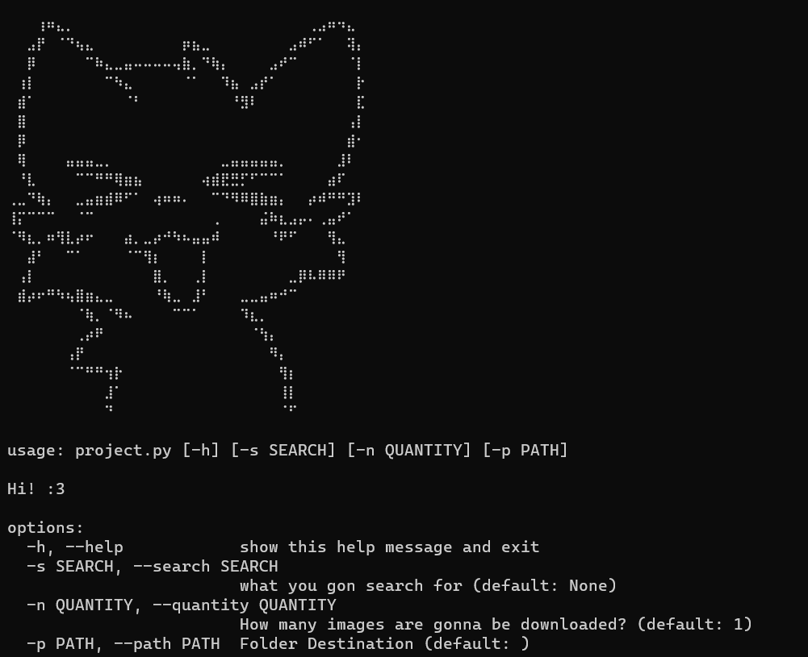
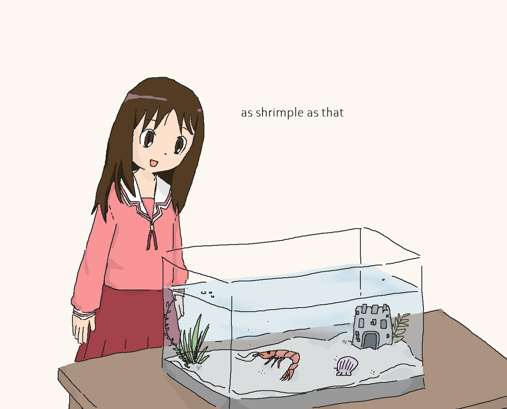

# A somewhat shrimple google image downloader

[](https://img.shields.io/badge/language-Python3-red)

Disclaimer: **The contributors do not assume any responsibility for the use of this tool.****

<p align="center">

</p>

#### Video Demo:  <URL HERE>
#### Description:
A somewhat shrimple google image downloader is an **utility** tool on google to scrape random images.

<p align="center">

</p>


#### How to use
1. Run `pip install -r requirements.txt`
2. Run and configure the CLI of the `project.py [-s SEARCH] [-n QUANTITY] [-p PATH]`

#### Tools and Commands 🧰
A somewhat shrimple google image downloader offers a command line interface to perform image scrapping. You can get:
```text
- search            Search for images.
- quantity          How many images are gonna be downloaded (n: 1-75). Default=1
- path              Where the images are gonna be downloaded on your PC. Default=Current directory
```

#### Explanation of the project ⚙️
1. Initiate a class named `imagedownloader` that only holds a parameter named `whatyouwannasearch` for the image you're going to search.
2. if parameter `whatyouwannasearch` is empty, ValueError's gonna be raised.
3. regular expression is used to substract string and avoid whitespace for `whatyouwannasearch`.
4. Starts a function called `getURL()` which will return the appropriate URL for google image.
5. Starts getting a request with `getrequest()` function.
6. Checks for connection, if it takes more than 20 seconds to be established or connection's bad. ConnectionError will be raised.
7. If request is established, request will be saved on `self.request`.
8. Next step is to call in `start()` function that holds 2 paramaters(`n` and `savepath`). `n` means how many images are gonna be downloaded and `savepath`'s where the images are gonna be downloaded in your PC, if `savepath` is empty then it's gonna be located on the current directory.
9. Due to some technical issues of google javascript where it's only gonna show 100 images / result with the header. getting 1-75 is the most appropriate numbers to get fixated images from google image. So, checks if n is more or equal than 1 or fewer or equal than 75. if it's true then continue, if false gonna raise ValueError
10. `getimagelink()` will be called to get image URLS on the `self.request.content`.
11. `self.request.content` will be prettified and be called as `soup`.
12. With the usage of regular expression, `r'\[\"https://encrypted[^,]+\",\d{1,10},\d{1,10}],\[\"https://[^,]+,\d{1,10},\d{1,10}]'` is used to match the string on the `soup`. Then the matched string will be proceed to be matched once more with `r'https://[^\"]+'`. The result's a list of image URls called `self.targeturl`
13. `saveimage()` is called to get the request of image url and save it to your PC.
14. A folder's created depending on where the `savepath` is.
15. If no image URL then will raise IndexError.
15. Get `n` number of images saved on the `savepath`. Allowed file extensions for download are ".jpg", ".png", ".jpeg". If specified url of image can't be requested for less than 10 seconds and not showing `r_image.status_code` 200. The url will be skipped to the next index of `self.targeturl` list.